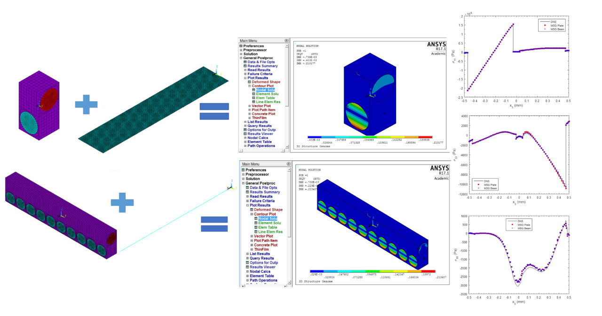
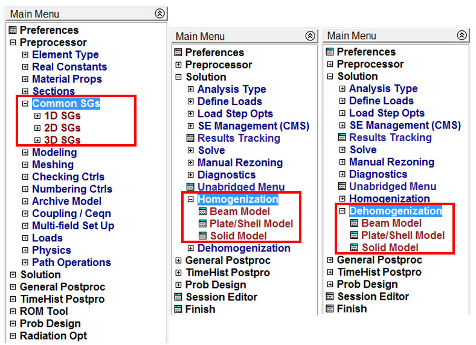

# ANSYS-SwiftComp GUI

**ANSYS-SwiftComp GUI** is an ANSYS plugin designed for multiscale modeling of composite materials and structures. It provides a user-friendly graphical interface for the SwiftComp tool, allowing users to perform homogenization and dehomogenization analysis efficiently within ANSYS.

For more information, visit this article: [ANSYS-SwiftComp GUI: ANSYS Plugin for Multiscale Modeling](https://www.linkedin.com/pulse/ansys-swiftcomp-gui-ansys-plugin-multiscale-modeling-banghua-zhao/)



## Features

- **Multiscale Modeling**: Supports modeling at both micro and macro scales, enabling accurate simulations of composite materials.
- **Homogenization**: Computes effective properties of heterogeneous materials, helping to bridge the gap between different scales.
- **Dehomogenization**: Recovers detailed stress/strain fields in the microstructure from macroscale results.
- **Seamless Integration**: Fully integrated with ANSYS Workbench, allowing for easy setup and execution of multiscale analysis.
- **User-Friendly Interface**: Intuitive GUI that simplifies the process of setting up and analyzing complex composite models.



## Requirements

- **ANSYS**: Version 19.0 or later (Workbench environment)
- **SwiftComp**: Compatible version of SwiftComp™ software
- **Operating System**: Windows (tested on Windows 10/11)
- **Memory**: Minimum 8GB RAM recommended for complex models
- **Storage**: At least 2GB free disk space

## Installation

1. Clone the repository:
   ```bash
   git clone https://github.com/banghuazhao/ANSYS-SwiftComp_GUI.git
   ```

2. Follow the instructions in the [ANSYS SwiftComp GUI Manual](./ANSYS-SwiftComp_GUI_Manual.pdf) to install the plugin within ANSYS Workbench.

## Quick Start

1. **Install the Plugin**: Run the installation script and follow the manual instructions
2. **Launch ANSYS Workbench**: Start ANSYS and navigate to the main menu
3. **Access SwiftComp GUI**: Find the SwiftComp menu item in the ANSYS interface
4. **Create Your Model**: Use the GUI to set up your composite material model
5. **Run Analysis**: Execute homogenization or dehomogenization analysis
6. **Review Results**: Analyze the results using ANSYS post-processing tools

## Directory Structure

```
ANSYS-SwiftComp_GUI/
├── Code/
│   ├── ANSYS_menulist_new/          # Updated ANSYS menu configurations
│   ├── ANSYS_menulist_old/          # Legacy ANSYS menu configurations
│   ├── SwiftCompGUI_APDL/           # APDL macro files for GUI functionality
│   └── SwiftCompGUI_UIDL/           # UIDL files for user interface definition
├── image/                           # Screenshots and documentation images
├── ANSYS-SwiftComp_GUI_Manual.pdf   # Complete installation and usage manual
├── SampleLaminateInput.txt          # Example input file for laminate analysis
├── Install.bat                      # Windows installation script
├── Uninstall.bat                    # Windows uninstallation script
└── README.md                        # This file
```

## Usage

The plugin integrates seamlessly into ANSYS Workbench, providing:

- **1D Analysis**: Beam and truss element homogenization
- **2D Analysis**: Plane stress/strain and plate/shell homogenization  
- **3D Analysis**: Solid element homogenization
- **Advanced Features**: Support for various unit cell geometries (square, hexagonal, honeycomb, spherical)

Refer to the [manual](./ANSYS-SwiftComp_GUI_Manual.pdf) for detailed usage instructions and examples.

## Resources

- **Documentation**: [ANSYS-SwiftComp GUI Manual](./ANSYS-SwiftComp_GUI_Manual.pdf)
- **SwiftComp**: [CDM Hub Resource](https://cdmhub.org/resources/1136)
- **Article**: [ANSYS-SwiftComp GUI: ANSYS Plugin for Multiscale Modeling](https://www.linkedin.com/pulse/ansys-swiftcomp-gui-ansys-plugin-multiscale-modeling-banghua-zhao/)
- **Sample Input**: [SampleLaminateInput.txt](./SampleLaminateInput.txt)

## Support

If you encounter any issues or have questions:

- **Issues**: Please use the [GitHub Issues](https://github.com/banghuazhao/ANSYS-SwiftComp_GUI/issues) page
- **Documentation**: Check the [manual](./ANSYS-SwiftComp_GUI_Manual.pdf) for detailed instructions
- **Contact**: For technical support, please refer to the SwiftComp documentation

## License

This project is licensed under the MIT License - see the [LICENSE](./LICENSE) file for details.

## About

ANSYS-SwiftComp GUI is a graphic user interface integrated into the Main Menu of ANSYS using APDL, which can use the preprocessing and postprocessing capability of ANSYS as a user-friendly GUI for SwiftComp™.

For more information about SwiftComp, visit: [cdmhub.org/resources/1136](https://cdmhub.org/resources/1136)

## Author

**Banghua Zhao**

- **GitHub**: [@banghuazhao](https://github.com/banghuazhao)
- **LinkedIn**: [Banghua Zhao](https://www.linkedin.com/pulse/ansys-swiftcomp-gui-ansys-plugin-multiscale-modeling-banghua-zhao/)

